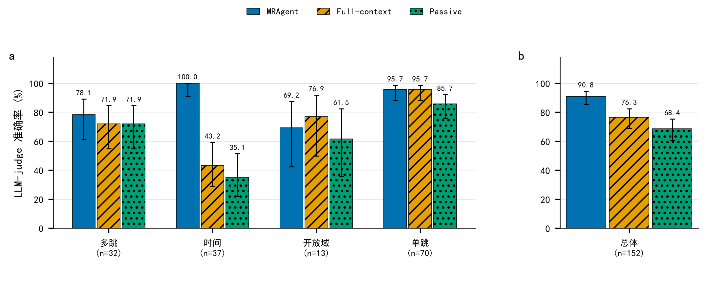

# MRAgent × DeepSeek：一次低成本复现与三臂消融

> 对 [**Ji-shuo/MRAgent**](https://github.com/Ji-shuo/MRAgent) 的复现改造。
> 原论文：*Memory is Reconstructed, Not Retrieved: Graph Memory for LLM Agents*（ICML 2026, arXiv:2606.06036）

把原仓库依赖的 **OpenRouter** 换成 **DeepSeek**，把付费 embedding 换成**本地模型**，
在 LoCoMo 的一个对话上跑通全流程，并做了 **MRAgent / Passive / Full-context 三臂对比**。

---

## 一句话结论

在完全相同的记忆、embedding 和初始检索前提下，**只把"多轮工具调用循环"去掉**，
准确率从 **90.79% 掉到 68.42%（−22.4 个点）**；而"完全不检索、把全文塞进 prompt"
反而比"一次性检索"更好（76.32%）。差距高度集中在**时间类问题**（100% vs 35% / 43%）。



---

## 一、实验设置

| 项目 | 配置 |
| --- | --- |
| 数据集 | LoCoMo，取 **conv-26**（199 题，五类题型齐全） |
| 答题模型 | `deepseek-flash`（**thinking 模式关闭**） |
| Embedding | 本地 `BAAI/bge-base-en-v1.5`（768 维，CPU，免费） |
| Judge | `deepseek-v4-pro` |
| 计分题 | 152 道（对抗题 47 道按仓库逻辑单独用字符串匹配计分，不进 judge） |

选择 conv-26 是因为它同时覆盖 LoCoMo 的五种题型（多跳 32 / 时间 37 / 开放域 13 / 单跳 70 / 对抗 47）。

## 二、结果

| 实验臂 | 多跳 (32) | 时间 (37) | 开放域 (13) | 单跳 (70) | **总体 (152)** |
| --- | --- | --- | --- | --- | --- |
| **MRAgent**（主动重构 + 工具循环） | 78.1% | **100.0%** | 69.2% | 95.7% | **90.79%** |
| Full-context（全文塞入 prompt） | 71.9% | 43.2% | **76.9%** | 95.7% | 76.32% |
| Passive（一次 top-k 直接答题） | 71.9% | 35.1% | 61.5% | 85.7% | 68.42% |

误差棒为 **Wilson 95% 置信区间**，类别名下方标注样本量 n。

### 三个关键观察

**1. 多轮工具循环贡献了 +22.4 个点。**
两条臂的原料、embedding、初始检索**完全相同**，唯一差别是 Passive 拿到初始上下文后一次性作答，
MRAgent 可以最多 8 轮继续调用工具。这是最干净的一次消融。

**2. 时间类题的差距是压倒性的（100% vs 35.1% / 43.2%）。**
原因是 `query_conversation_time` 工具能返回事件所在对话的发生时间，模型据此把相对表述锚定成绝对日期。

```
Q: When did Caroline give a speech at a school?
   gold:          The week before 9 June 2023
   MRAgent:       the week before 9 June 2023   ← 完全正确
   Full-context:  Not mentioned                 ← 信息就在上下文里，却放弃了
   Passive:       the week before 7 May 2023    ← 锚定到了错误的对话

Q: When did Melanie go to the pottery workshop?
   gold:          The Friday before 15 July 2023
   MRAgent:       14 July 2023                  ← 正确
   Full-context:  Not mentioned
   Passive:       6 May 2023
```

统计上，时间类题中「MRAgent 判对、且另外两条臂都判错」的共有 **14 道**。

**3. 反直觉的结果：全文塞进 prompt 反而优于一次性检索。**
Full-context（76.32%）明显高于 Passive（68.42%）。在这个 embedding 模型下，
**"退化成一次 top-k"比"根本不检索"损失更大**——这反过来支持了 MRAgent 的核心论点：
收益主要不来自"检索得更准"，而来自"能反复检索、按中间证据调整方向"。

## 三、成本

| 项目 | API 调用 | 成本（低峰） |
| --- | --- | --- |
| MRAgent 臂 | 1,844 | $1.065 |
| Passive + Full-context | 1,021 | $0.581 |
| Judge × 3 次评测 | ≈460 | ≈$0.30 |
| **合计** | ≈3,300 | **≈ $1.95** |

逐题 token 用量记录在 `results/token_usage.jsonl`（2,865 条），可用脚本复核。
低峰时段为北京时间工作日 09:00–12:00、14:00–18:00 之外（含整个周末），价格是高峰的一半。

## 四、与原仓库的差异

### 1. 服务商解耦（改代码 → 改配置）

原仓库把 OpenRouter 的端点和密钥硬编码在多处。本项目改为全部由 `.env` 驱动，
换服务商不需要改代码：

- `common/config.py`：端点/密钥/模型改为环境变量 + 别名表，新增 `--maxq`（限制每样本题数，便于小样验证）、`USAGE_LOG`
- `llm/controller.py`：新增 `LLM_DROP_PARAMS` / `LLM_EXTRA_BODY` 两个开关
- `llm/embeddings.py`、`eval/judge.py`：端点与模型可独立配置

### 2. 本地 embedding 后端

DeepSeek 不提供 embeddings API，因此 `llm/rag_utils.py` 新增 `EMBED_BACKEND=local`，
用 `sentence-transformers` 在 CPU 上跑 `bge-base-en-v1.5`。

两个必须注意的细节：

- **必须归一化**（`normalize_embeddings=True`）。`common/utils.py` 的
  `topk_answers_by_similarity()` 默认用**点积**（全项目没有任何一处传 `cosine`），
  它等价于余弦相似度**仅仅因为**向量被 L2 归一化过。少这一步检索排序会直接退化。
- **BGE 的指令前缀只加在查询侧**。`get_embeddings(inputs, mode)` 的 `mode` 参数正好用来区分
  `query` / `context`。

### 3. 修掉 4 个真跑才暴露的 bug

静态读代码发现不了，都是跑起来才暴露的。前三个是**原仓库自带**的问题：

| # | 问题 | 后果 | 修法 |
| --- | --- | --- | --- |
| 1 | `agent.py` 调用 `check_key_json(..., replace=True)`，但 `schema.py` 里**没有这个参数** | 关键词 JSON 连续 3 次校验失败时**直接崩溃** | 补 `replace` 参数并实现修复模式（丢弃非法条目 + 对漏掉 `-n` 后缀的 id 做唯一前缀重映射） |
| 2 | 模型生成退化，改写出扁平对象而非 `{sentence:[...]}` | 建图/向量化阶段对 `None` 迭代崩溃 | 三处加防御，降级为跳过该 session |
| 3 | `question_keys["keywords"]` 可能是 `null` | 整道题丢失 | `answer_question` 与 `set_queried_keywords` 加空值兜底 |
| 4 | `run.py` 按文件是否存在跳过**整个**改写阶段 | 改写无法按 session 续跑，坏 session 不能单独重生成 | 改为始终调用 `rewrite_sample`，内部按 session 续跑 |

### 4. 新增对比实验与绘图

- `experiments/compare_arms.py`：Passive 与 Full-context 两条对照臂。
  实现方式是 **monkey-patch 答题环节**，复用 MRAgent 的完整前置流程，
  保证三条臂的原料和起点完全一致。
- `experiments/plot_three_arms.py`：从 judge 逐题结果**直接计算**准确率与 Wilson 置信区间并绘图，
  不手抄数字。

## 五、快速开始

### 1. 环境

```bash
# 需要 Python 3.11（numpy 1.26.4 / torch 2.8.0 没有 3.12+ 的 wheel）
python -m venv .venv

# 关键：--no-cache-dir 避免受限网络下 pip 卡死；镜像加速
.venv/bin/pip install --no-cache-dir -i https://pypi.tuna.tsinghua.edu.cn/simple -r requirements.txt
```

> `regex==2022.4.24` 在 PyPI 上只有源码包、需要 C 编译器。它在本项目里只用于
> `eval/evaluation.py` 的一句正则，换成 `regex>=2023` 即可（有 wheel）。

### 2. 配置

```bash
cp .env.example .env
# 编辑 .env，填入你的 DeepSeek key
```

`.env` 已在 `.gitignore` 中，**不会被提交**。

如果用本地 embedding，还要先把模型下好：

```bash
export HF_ENDPOINT=https://hf-mirror.com      # 国内必需，huggingface.co 直连会超时
export HF_HOME=./hf_cache
python -c "from sentence_transformers import SentenceTransformer; SentenceTransformer('BAAI/bge-base-en-v1.5')"
```

### 3. 跑

```bash
# 先跑 10 题验证配置与连通性（约 $0.05）
python run.py --data locomo --model deepseek --file demo --sample 26 --maxq 10

# 跑完整 conv-26（199 题，约 $1）
python run.py --data locomo --model deepseek --file ds26 --sample 26

# 评测
python eval/evaluate_reasoning.py --data locomo --model deepseek --file ds26 --allfile
```

### 4. 复现三臂对比

```bash
cd experiments
ARM=passive     FILE_TAG=passive python compare_arms.py
ARM=fullcontext FILE_TAG=fullctx python compare_arms.py
python plot_three_arms.py
```

## 六、目录结构

```
run.py                    主入口
agent/  common/  llm/  memory/  prompts/  eval/    改造后的核心代码
data/                    数据加载（dataset_locomo.json 已内置）
experiments/             对比实验与绘图脚本
results/                 三臂预测、judge 逐题判定、token 用量
figs/                    对比图（PDF / SVG / PNG / 灰度版）
docs/                    详细文档（见下）
tools/                   不花钱的离线自检脚本
```

`docs/` 里的文档：

| 文档 | 内容 |
| --- | --- |
| `MRAgent-复现规划.md` | 项目剖析、硬件/数据/成本规划、避坑清单 |
| `MRAgent-DeepSeek改造说明.md` | 逐文件改动清单与验证记录 |
| `MRAgent-conv26-DeepSeek-结果.md` | conv-26 单臂结果 |
| `MRAgent-三臂对比结果.md` | 三臂对比正文（含你修改过的版本） |
| `README_upstream.md` | 原仓库 README，便于对照 |

## 七、已知局限（重要）

**结论不能与论文直接对比。** 四点差异：

1. **只跑了一段对话**（conv-26，152 道计分题）。论文是 10 段对话、1986 题的汇总。
   152 道题的 95% 置信区间约 **±7.3 个点**，所以：
   - MRAgent vs Passive（+22.4）和时间类差距（+57）**远超噪声，可信**
   - 「单跳题打平」（35 题）和「开放域 Full-context 超过 MRAgent」（13 题）**在噪声范围内，不应作为结论**
2. **Judge 不同**：这里用 `deepseek-v4-pro`，论文用 `gpt-4o-mini`。
3. **Embedding 不同**：这里用本地 `bge-base-en-v1.5`，论文用 `text-embedding-3-large`。
4. **论文是 3 次独立重复取均值**，这里只跑了一次。

论文 Table 1（Gemini backbone）的 MRAgent 为：多跳 75.17 / 时间 80.37 / 开放域 68.75 / 单跳 90.48，总体 84.21。
本次在**这一段对话**上普遍略高，但样本不同，只能说明流程正确、效果在同一量级。

**其他局限：**

- 只做了「有/无工具循环」的消融，没有复现论文其余基线（A-Mem / MemoryOS / LangMem / Mem0）。
  本项目的 Passive 臂复用 MRAgent 自己的记忆结构，隔离性更好，但因此**不能与论文 Table 1 的 RAG 行直接对标**。
- 时间类题的差距里，`query_conversation_time` **单个工具**贡献极大，不代表任意多轮检索都有同等收益。
- **judge 的 token 用量没有被记账**（`eval/judge.py` 使用独立的 client），报告里那部分是按调用次数估算的。

## 八、许可证与致谢

核心代码来自 [Ji-shuo/MRAgent](https://github.com/Ji-shuo/MRAgent)，本仓库是在其基础上做的
复现改造（原仓库未附 LICENSE，属默认保留所有权利）。请以原仓库为准引用方法本身。

```bibtex
@inproceedings{ji2026mragent,
  title     = {Memory is Reconstructed, Not Retrieved: Graph Memory for LLM Agents},
  author    = {Ji, Shuo and Li, Yibo and Hooi, Bryan},
  booktitle = {Proceedings of the 43rd International Conference on Machine Learning},
  year      = {2026}
}
```

数据：[LoCoMo](https://arxiv.org/abs/2402.17753)（Maharana et al., ACL 2024）。
